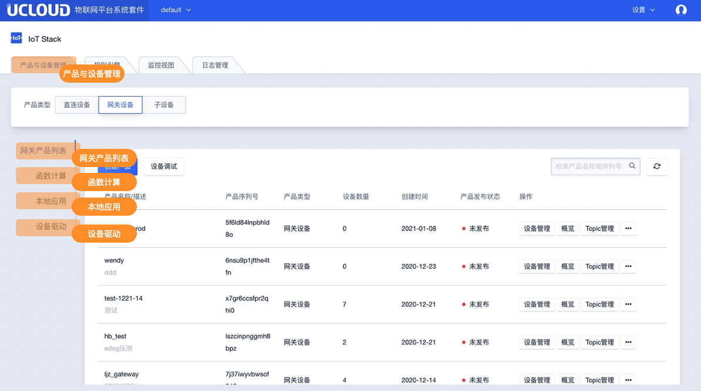
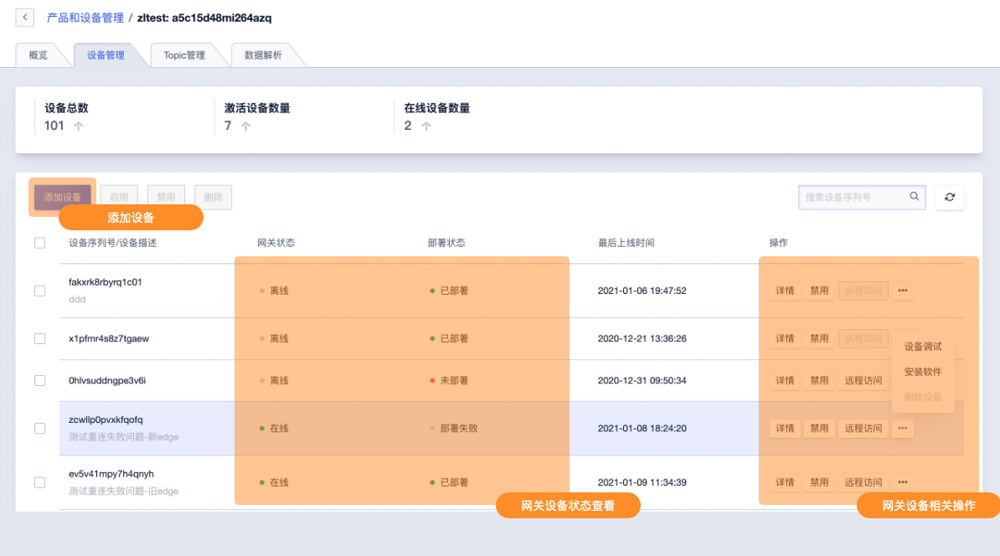
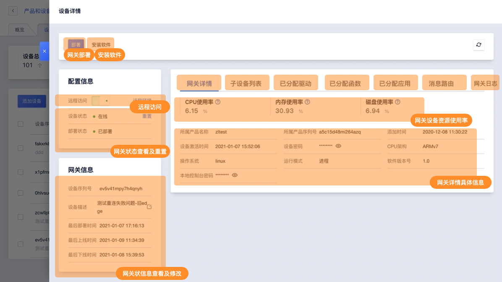

# 网关功能概述

网关是IoT平台为工业、能源、楼宇等需要本地实时响应、就近计算、多协议接入的场景而提供的一套软件运行时，客户可以直接部署到符合要求的x86、arm硬件平台上，实现设备接入、边缘计算等功能。

网关提供子设备接入、函数计算、本地应用、消息路由、消息远程SSH运维，提供完整的边缘端解决方案。

## 一、网关功能说明

### 1、网关设备管理

网关设备管理功能包括：

- 网关设备的添加、删除、修改、查询
- 网关设备启用、禁用、状态查询、部署、部署状态查询
- 网关设备的子设备列表、驱动分配、函数分配、本地应用分配、消息路由配置及相关运行状态查看
- 网关设备的子设备的绑定、解绑、启用、禁用及状态查看
- 网关设备同时可使用Topic管理、规则引擎、设备调试功能
- 网关设备支持WebSSH方式远程连接，方便远程登录网关设备，进行运维工作
- 针对某些不能联网的场景或本地需要临时修改的场景，边缘网关提供本地控制台帮助管理网关的资源与配置

### 2、子设备管理

提供对子设备的全生命周期管理，查看子设备的及所属网关等相关信息。

功能包括：

- 子设备的添加、删除、修改、查询
- 子设备所属网关信息
- 子设备启用、禁用及状态查询
- 子设备同时可使用Topic管理、规则引擎、设备调试功能

### 3、设备驱动

子设备驱动，用户可以根据子设备接入的特有协议，适配驱动框架，从而方便子设备的快速接入。

功能包括：

- 驱动的添加、删除、修改、下载
- 驱动的基本信息展示，包括通信协议、开发语言、CPU架构、驱动类型等
- 驱动分配到网关
- 驱动配置，包括网关设备层的配置、子设备层的配置

### 4、函数计算

函数计算是一种数据处理规范，方便用户定义自己的数据处理与业务逻辑，比如就近控制、数据解析、数据清洗、数据脱敏等。

功能包括：

- 函数的添加、删除、修改
- 函数的基本信息展示，包括函数名称、函数描述、开发语言等
- 函数计算分配到网关
- 函数配置
- 容器配置

### 5、本地应用

本地应用是网关的核心功能，可以帮助用户在网关上运行自己的业务逻辑。

功能包括：

- 应用的添加、删除、修改
- 应用的基本信息展示，包括应用名称、应用描述、添加方式
- 本地应用分配到网关
- 函数配置
- 容器配置

### 6、消息路由

消息路由可以配置不同源到不同目的地的消息流转路径。每条消息路由包含三要素：消息源、源消息的主题过滤、消息目的地。消息源和目的地可以是IoT平台、函数计算、本地应用、子设备。

## 二、操作指南

### 1、网关产品相关功能

在IoT平台首页进入产品与设备管理后，设备类型选择网关设备即可查看网关产品列表及主要功能。

**网关产品列表**

进入后可依据产品进行分类管理网关设备。

**函数计算**

未分配的函数计算列表，此列表下函数为当前项目下共有，可创建删除修改函数。使用时需按照需要分配到具体的网关设备下进行使用。

注：函数计算不区分版本，如修改已分配到网关设备中的函数计算也会使未分配的函数计算进行同步修改。

**本地应用**

未分配的本地应用列表，此列表下应用为当前项目下共有，可创建删除修改应用。使用时需按照需要分配到具体的网关设备下进行使用。

**设备驱动**

未分配的设备驱动列表，此列表下应用为当前项目下共有，可创建删除修改设备驱动。使用时需按照需要分配到具体的网关设备下进行使用。

### 2、网关设备列表

在网关产品列表中选择产品后可查看网关设备列表列表可查看网关设备的状态并对其进行操作

**网关状态说明**

* 未激活：设备激活也叫设备注册，指设备第一次成功连接IoT平台。如IoT平台已经添加设备，但设备未激活时设备将展示为未激活状态

* 在线/离线：已激活的设备会保持在线状态；当设备因为网络或其他原因与IoT平台断开链接，设备状态会改为离线

**部署状态说明**

* 未部署：网关设备未进行部署
* 已部署：网关设备成功部署过
* 部署失败：网关设备最后一次部署失败，点击可查看部署日志

**操作说明：**

* 设备详情：进入设备详情页面进行网关详情及配置管理
* 禁用/启用设备：IoT平台可主动管理设备是否可以连接到平台即禁用/启用设备。设备被禁用后将无法与IoT平台连接，启用后可恢复连接
* 远程访问：WebSSH方式远程连接，方便远程登录网关设备，进行运维工作
* 设备调试：可向通过控制台模拟下发Topic信息给设备并即时查看平台日志
* 安装软件：使用当前网关硬件信息获取安装脚本
* 删除设备：删除网关设备，后网关下的子设备将自动解绑拓扑关系

### 3、网关详情

在网关设备列表中即可进入具体的网关详情进行操作

**网关部署**

将当前配置下发到网关中。

**安装软件**

使用当前网关硬件信息获取安装脚本。

**远程访问**

WebSSH方式远程连接，方便远程登录网关设备，进行运维工作。

**网关状态查看及重置**

* 网关状态
  * 未激活：设备激活也叫设备注册，指设备第一成功连接IoT平台。如IoT平台已经添加设备，但设备未激活时设备将展示为未激活状态
  * 在线/离线：已激活的设备会保持在线状态；当设备因为网络或其他原因与IoT平台断开链接，设备状态会改为离线
  * 重置网关状态：已激活的设备可在IoT平台的设备详情中进行状态重置，重置后设备将为未激活状态。

* 网关部署状态
  * 未部署：网关设备未进行部署
  * 已部署：网关设备成功部署过
  * 部署失败：网关设备最后一次部署失败

**网关信息**

查看当前网关的信息，包括产品序列号、设备序列号等信息，其中设备描述可进行修改。

**网关详情**

展示网关的相关信息，包括资源占用情况、设备硬件配置信息等，可查看设备密钥及本地控制台密码。

**子设备列表**

可以进行网关的子设备相关管理。

**已分配驱动**

可以进行网关已经分配的设备驱动的相关管理。

**已分配函数**

可以进行网关已经分配的函数计算相关管理。

**已分配应用**

可以进行网关已经分的本地应用相关管理。

**消息路由**

可以进行网关的消息路由等相关管理。

**网关日志**

查看当前网关的日志信息。

